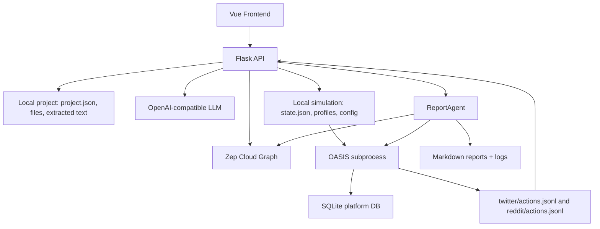

# MiroFish Architecture And Workflow Analysis

Source analyzed: `666ghj/MiroFish`, commit `96096ea0ff42b1a30cbc41a1560b8c91090f9968`.

MiroFish is a full-stack application that turns source documents and a natural-language prediction request into a simulated social world. Its core pipeline is:

1. extract text from uploaded documents;
2. ask an LLM to generate a social ontology adapted to the scenario;
3. build a knowledge graph in Zep;
4. convert graph entities into OASIS agents;
5. generate a simulation configuration;
6. run a Twitter/Reddit-style simulation through OASIS;
7. read back agent actions to visualize, interview agents, and generate a report.

## Tech Stack

- Backend: Flask, organized with API blueprints.
- Frontend: Vue 3, Vite, Vue Router, Axios, D3 for graph visualization.
- LLM: OpenAI-compatible client, configured via `LLM_API_KEY`, `LLM_BASE_URL`, `LLM_MODEL_NAME`.
- Memory and graph: Zep Cloud.
- Social simulation: `camel-oasis` and `camel-ai`.
- Local persistence: JSON, CSV, SQLite, and JSONL files under `backend/uploads`.
- Dev orchestration: root npm scripts start backend and frontend together.

Key files:

- `backend/run.py`: backend entrypoint.
- `backend/app/__init__.py`: Flask app factory, CORS, blueprints, simulation cleanup.
- `backend/app/api/graph.py`: upload, ontology generation, graph building.
- `backend/app/api/simulation.py`: simulation creation, preparation, execution, monitoring, interviews.
- `backend/app/api/report.py`: report generation and report chat.
- `backend/scripts/run_parallel_simulation.py`: OASIS Twitter + Reddit simulation.
- `backend/scripts/action_logger.py`: JSONL action logs.
- `frontend/src/router/index.js`: main frontend routes.
- `frontend/src/api/*.js`: frontend HTTP API clients.

## Global Architecture



The backend acts as the orchestrator. It does not run OASIS inside the Flask process. Instead, it starts separate Python simulation scripts and monitors the files those scripts produce. This keeps the web server simpler and lets the app stop simulations at the process level.

## End-To-End Flow

### 1. Project Creation And Ontology Generation

Main endpoint: `POST /api/graph/ontology/generate`.

The frontend sends:

- one or more PDF, Markdown, or TXT files;
- a natural-language simulation request;
- an optional project name;
- optional additional context.

The backend:

1. creates a `project_id` like `proj_xxxxxxxx`;
2. saves files under `backend/uploads/projects/<project_id>/files`;
3. extracts text with `FileParser`:
   - PDFs through PyMuPDF;
   - TXT/MD with encoding detection;
4. normalizes the text with `TextProcessor.preprocess_text`;
5. stores it in `extracted_text.txt`;
6. calls `OntologyGenerator`.

`OntologyGenerator` uses a highly constrained prompt. It forces the LLM to produce:

- exactly 10 entity types;
- the first 8 tailored to the scenario;
- the last 2 as mandatory fallbacks: `Person` and `Organization`;
- 6 to 10 relationship types;
- entity names in PascalCase;
- relationship names in UPPER_SNAKE_CASE;
- attribute names in snake_case;
- no abstract entities such as "opinion", "sentiment", or "trend".

The code post-processes the LLM output:

- automatic conversion to PascalCase;
- deduplication;
- fallback insertion if missing;
- limit to 10 entity types and 10 relationship types, matching Zep constraints;
- renaming reserved attributes such as `name`, `uuid`, and `summary`.

This is a central design choice: MiroFish wants every extracted entity to be a potential social actor capable of speaking.

### 2. Zep Graph Building

Main endpoint: `POST /api/graph/build`.

The backend:

1. loads the project and extracted text;
2. creates an async task in `TaskManager`;
3. splits text into chunks, defaulting to 500 characters with 50 characters overlap;
4. creates a standalone Zep graph with an id like `mirofish_xxxxxxxx`;
5. configures the Zep ontology by dynamically creating Pydantic classes;
6. sends chunks in batches of 3 episodes;
7. waits until each Zep episode is marked `processed`;
8. retrieves nodes and edges;
9. updates `project.json` with the `graph_id` and `graph_completed` status.

Interesting detail: the code does not generate and execute a separate Python ontology file. It dynamically builds Zep ontology classes in memory from the ontology JSON.

### 3. Simulation Creation

Endpoint: `POST /api/simulation/create`.

This creates a `simulation_id` like `sim_xxxxxxxx`, attached to:

- `project_id`;
- `graph_id`;
- enabled platforms: Twitter and/or Reddit;
- initial status: `created`.

The state is stored in:

```text
backend/uploads/simulations/<simulation_id>/state.json
```

### 4. Simulation Preparation

Main endpoint: `POST /api/simulation/prepare`.

This is the step that transforms a document graph into a population of agents.

The backend starts a background task that does four things.

**Reads Zep entities**

`ZepEntityReader` reads all graph nodes and edges. It keeps only nodes that have at least one label other than `Entity` or `Node`. This is how MiroFish distinguishes ontology-mapped entities from generic entities extracted by Zep.

For each retained entity, it enriches the object with:

- attributes;
- incoming and outgoing relationships;
- neighboring nodes;
- entity type.

**Generates OASIS profiles**

`OasisProfileGenerator` converts each entity into an `OasisAgentProfile`.

The profile contains:

- `user_id`;
- `username`;
- `name`;
- `bio`;
- `persona`;
- social metrics such as `karma`, `friend_count`, `follower_count`, `statuses_count`;
- age, gender, MBTI, country, profession, interests;
- source entity uuid and type.

If LLM generation is enabled, the generator:

1. searches Zep for more context, across both edges and nodes;
2. distinguishes individual entities from institutional/group entities;
3. asks the LLM for a long, detailed persona;
4. repairs truncated or invalid JSON when possible;
5. falls back to rule-based generation if LLM generation fails.

Output formats differ by platform:

- Reddit: `reddit_profiles.json`;
- Twitter: `twitter_profiles.csv`, because OASIS expects that format.

**Generates simulation configuration**

`SimulationConfigGenerator` generates the configuration through multiple LLM calls to avoid overly long outputs:

1. time configuration;
2. initial events;
3. agent activity configuration in batches of 15;
4. platform configuration.

The time configuration includes:

- total simulated hours;
- minutes per round;
- min/max active agents per hour;
- peak hours;
- off-peak hours;
- activity multipliers.

Each agent receives:

- activity level;
- posts per hour;
- comments per hour;
- active hours;
- response delay;
- sentiment bias;
- stance: `supportive`, `opposing`, `neutral`, `observer`;
- influence weight.

Initial posts are assigned a `poster_type`, then the code maps them to a real `poster_agent_id`. If the type does not match, it selects the most influential agent.

**Saves artifacts**

Preparation produces:

```text
backend/uploads/simulations/<simulation_id>/
  state.json
  reddit_profiles.json
  twitter_profiles.csv
  simulation_config.json
```

The simulation status becomes `ready`.

### 5. OASIS Execution

Main endpoint: `POST /api/simulation/start`.

The backend calls `SimulationRunner.start_simulation`, which:

1. loads `simulation_config.json`;
2. computes the total number of rounds;
3. creates or reloads `run_state.json`;
4. starts a Python subprocess:
   - `run_twitter_simulation.py`,
   - `run_reddit_simulation.py`,
   - or `run_parallel_simulation.py`;
5. redirects stdout/stderr into `simulation.log`;
6. starts a monitoring thread.

Inside `run_parallel_simulation.py`, each platform:

1. creates a CAMEL model through `ModelFactory.create`;
2. generates the OASIS agent graph from the profile file;
3. creates an OASIS Twitter or Reddit environment with SQLite;
4. executes initial posts at round 0;
5. loops through simulation rounds;
6. selects active agents based on simulated hour, `active_hours`, and `activity_level`;
7. lets OASIS choose an LLM action for each active agent;
8. reads the OASIS SQLite database to retrieve the actual actions;
9. writes actions to `actions.jsonl`.

Agent activation is therefore probabilistic, but constrained by the configuration generated before the simulation.

Log structure:

```text
backend/uploads/simulations/<simulation_id>/
  simulation.log
  run_state.json
  twitter/
    actions.jsonl
  reddit/
    actions.jsonl
  twitter_simulation.db
  reddit_simulation.db
```

The backend monitoring thread periodically reads `actions.jsonl` and updates:

- current round;
- simulated hours;
- action counters;
- platform status;
- recent actions.

It also detects `simulation_end` events.

### 6. Dynamic Graph Memory Updates

Option: `enable_graph_memory_update`.

When enabled, the runner creates a `ZepGraphMemoryUpdater`. For every meaningful action, it converts the action into a natural-language sentence and adds it to Zep as an episode.

Examples:

- `CREATE_POST` becomes a sentence like "Agent X posted...";
- `LIKE_POST` includes the post content and author when available;
- `CREATE_COMMENT` includes the comment content and target post.

`DO_NOTHING` actions are ignored.

This lets the graph evolve with simulated events. It is the project's "temporal memory" mechanism for the simulated world.

### 7. Agent Interviews

MiroFish keeps OASIS environments alive after the main simulation loop ends. This allows the backend to send interview commands.

The backend and OASIS script communicate through files:

```text
ipc_commands/<command_id>.json
ipc_responses/<command_id>.json
env_status.json
```

Command types:

- `interview`;
- `batch_interview`;
- `close_env`.

The backend writes a command, the script detects it, executes a `ManualAction(ActionType.INTERVIEW)`, then reads the response from the OASIS SQLite database.

MiroFish also prefixes interview questions to make the agent respond directly without tool calls:

```text
结合你的人设、所有的过往记忆与行动，不调用任何工具直接用文本回复我：
```

### 8. ReportAgent

Main endpoint: `POST /api/report/generate`.

`ReportAgent` generates a Markdown prediction report. It is built as a ReACT-style tool-using agent.

Available tools:

- `insight_forge`: deep search, decomposes a question into subquestions and combines semantic search, entities, and relationships;
- `panorama_search`: broad graph overview, active and historical facts;
- `quick_search`: simple search;
- `interview_agents`: selects relevant agents, interviews them through OASIS, then integrates their answers.

Flow:

1. plan a 2 to 5 section outline;
2. generate the report section by section;
3. require multiple tool calls for each section;
4. produce a `Final Answer` for the section;
5. save sections progressively;
6. assemble the final Markdown.

The system prompt frames the simulation output in a specific way: agent actions are not merely logs, but projected future behavior under the simulation conditions.

Reports and logs live in:

```text
backend/uploads/reports/<report_id>/
  report.json
  report.md
  section_01.md
  section_02.md
  agent_log.jsonl
  console_log.txt
```

Report chat reuses the existing report and only calls tools if the report content is not sufficient.

## Frontend

The Vue frontend organizes the user journey into pages:

- `/`: home and history;
- `/process/:projectId`: graph construction;
- `/simulation/:simulationId`: simulation preparation;
- `/simulation/:simulationId/start`: execution and monitoring;
- `/report/:reportId`: report reading;
- `/interaction/:reportId`: post-report interaction.

API calls are centralized in:

- `frontend/src/api/graph.js`;
- `frontend/src/api/simulation.js`;
- `frontend/src/api/report.js`.

Axios automatically adds `Accept-Language`, allowing the backend to propagate locale into background threads.

Graph visualization uses D3 in process views/components. The frontend polls status endpoints to track long-running tasks:

- graph generation;
- profile generation;
- simulation execution;
- report generation.

## Persistence Model

MiroFish mixes three persistence layers.

**Local persistent storage**

- projects in `backend/uploads/projects`;
- simulations in `backend/uploads/simulations`;
- reports in `backend/uploads/reports`;
- logs and SQLite databases.

**Process memory**

- `TaskManager` stores tasks only in memory;
- `SimulationRunner` keeps processes and run states in memory, with file backup;
- internal simulation caches.

**Cloud**

- Zep Cloud for graphs and episodes;
- the LLM provider for ontology, personas, config, and reports.

Important consequence: after a backend restart, projects/simulations/reports still exist, but in-flight tasks tracked by `TaskManager` may be lost.

## Main API Surface

Graph:

- `POST /api/graph/ontology/generate`
- `POST /api/graph/build`
- `GET /api/graph/task/<task_id>`
- `GET /api/graph/data/<graph_id>`
- `GET /api/graph/project/<project_id>`

Simulation:

- `POST /api/simulation/create`
- `POST /api/simulation/prepare`
- `POST /api/simulation/prepare/status`
- `POST /api/simulation/start`
- `POST /api/simulation/stop`
- `GET /api/simulation/<simulation_id>/run-status`
- `GET /api/simulation/<simulation_id>/run-status/detail`
- `GET /api/simulation/<simulation_id>/actions`
- `GET /api/simulation/<simulation_id>/timeline`
- `GET /api/simulation/<simulation_id>/agent-stats`
- `GET /api/simulation/<simulation_id>/posts`
- `POST /api/simulation/interview`
- `POST /api/simulation/interview/batch`
- `POST /api/simulation/env-status`
- `POST /api/simulation/close-env`

Report:

- `POST /api/report/generate`
- `POST /api/report/generate/status`
- `GET /api/report/<report_id>`
- `GET /api/report/by-simulation/<simulation_id>`
- `POST /api/report/chat`
- `GET /api/report/<report_id>/sections`
- `GET /api/report/<report_id>/progress`
- `GET /api/report/<report_id>/download`

## Reusable Ideas

### 1. Constrained ontology before extraction

Instead of asking the graph to extract "everything", MiroFish forces an ontology oriented around social simulation. This is highly reusable: if the goal is behavioral simulation, entities must be actors, not concepts.

### 2. Document graph to agent population

The transformation `Zep entity -> OASIS persona -> activity config` is the most interesting part. It creates a bridge between RAG and multi-agent simulation.

### 3. Stepwise simulation configuration

Configuration is generated through several LLM calls:

- time;
- events;
- agents by batch;
- platforms.

This is more robust than one huge monolithic JSON response.

### 4. Subprocess-based simulation

The backend does not block Flask. It starts an OASIS process, writes file logs, and reconstructs state by reading those logs. This is simple and effective for a local/demo app.

### 5. JSONL logs as monitoring interface

`actions.jsonl` is the stable interface between the simulation engine and the backend. It is easy to debug, stream, replay, and analyze.

### 6. File-based interview IPC

The interview system is basic but clever: as long as the OASIS environment remains alive, the backend can inject `ManualAction` commands and retrieve answers.

### 7. Tool-using report agent

The ReportAgent does not write from a single summary. It has tools to search the graph, interview agents, and then produce traceable report sections.

## Limits And Things To Harden

- Flask threaded mode plus in-memory tasks is fragile with multiple workers or restarts.
- `TaskManager` is not persistent: a long task can become invisible after a restart.
- File-based IPC is simple, but not ideal for high concurrency or distributed environments.
- There is no real job queue: background threads are started directly from endpoints.
- Zep and the LLM are central dependencies: without API keys, the system can do very little.
- Prompts are long and strongly oriented toward Chinese/social-media contexts; they need adaptation.
- The frontend relies heavily on polling. SSE or WebSockets would be cleaner for a sturdier version.
- OASIS formats differ by platform: Reddit JSON, Twitter CSV. This leaks into the app code.
- Persona and config generation can become expensive if many entities are extracted.
- License is AGPL-3.0: be careful about direct code reuse. For inspiration, it is safer to reuse patterns rather than copy code.

## Useful Data Shapes To Reproduce

A minimal project:

```json
{
  "project_id": "proj_xxx",
  "name": "Scenario",
  "status": "ontology_generated|graph_building|graph_completed",
  "files": [],
  "total_text_length": 0,
  "ontology": {
    "entity_types": [],
    "edge_types": []
  },
  "graph_id": "mirofish_xxx",
  "simulation_requirement": "...",
  "chunk_size": 500,
  "chunk_overlap": 50
}
```

A minimal simulation:

```json
{
  "simulation_id": "sim_xxx",
  "project_id": "proj_xxx",
  "graph_id": "mirofish_xxx",
  "enable_twitter": true,
  "enable_reddit": true,
  "status": "created|preparing|ready|running|completed|failed",
  "entities_count": 0,
  "profiles_count": 0,
  "entity_types": [],
  "config_generated": false,
  "current_round": 0
}
```

An action log entry:

```json
{
  "round": 12,
  "timestamp": "2026-01-01T12:00:00",
  "agent_id": 4,
  "agent_name": "Some Agent",
  "action_type": "CREATE_POST",
  "action_args": {
    "content": "..."
  },
  "result": null,
  "success": true
}
```

## What We Can Reuse In Our Own Version

For an inspired implementation, I would reuse these pieces first:

1. An explicit pipeline: `documents -> ontology -> graph -> agents -> config -> simulation -> report`.
2. An ontology limited to social actors capable of taking actions.
3. Persona generation enriched by graph context.
4. Per-agent temporal and behavioral configuration.
5. JSONL logs as the contract between simulation and UI.
6. A tool-using report agent that can search the graph and interview agents.

I would probably change these parts:

1. Replace in-memory threads/tasks with a real persistent queue.
2. Replace file-based IPC with a sturdier channel for production use.
3. Decouple simulation platforms so something other than Twitter/Reddit can be plugged in.
4. Store state in a database instead of JSON files if multiple users are involved.
5. Add a "dry run" or "small run" mode to estimate LLM cost before launching a simulation.

## Mental Model

MiroFish is not just a RAG tool. It is a converter from corpus to artificial society:

```text
Corpus + objective
  -> actor ontology
  -> Zep graph
  -> agents with memory/persona
  -> activity rules
  -> simulated social world
  -> action logs
  -> interviews and predictive report
```

The project is strongest in the bridge it builds between knowledge extraction and multi-agent simulation. Its weakest point is the still prototype-like local infrastructure: many files, threads, polling, and cloud dependencies. If we use it as inspiration, the best path is to reuse the conceptual pipeline while hardening the orchestration around it.
